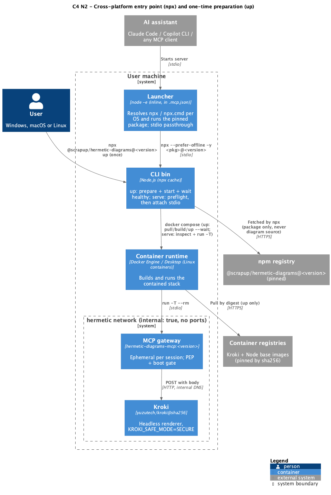
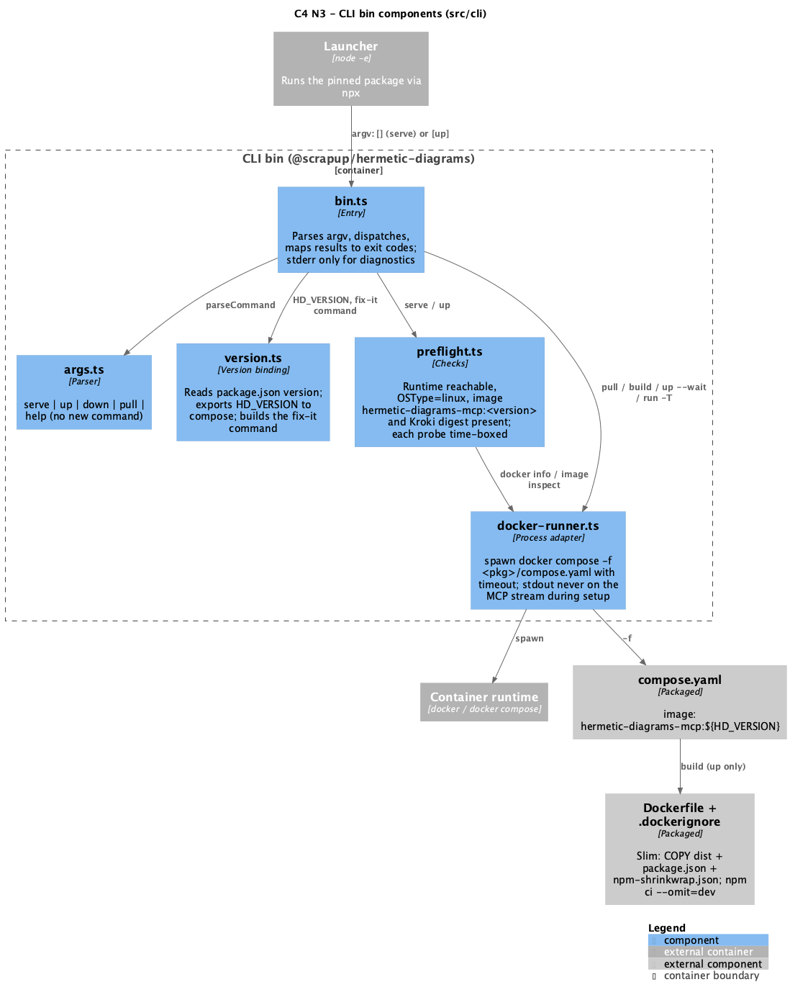
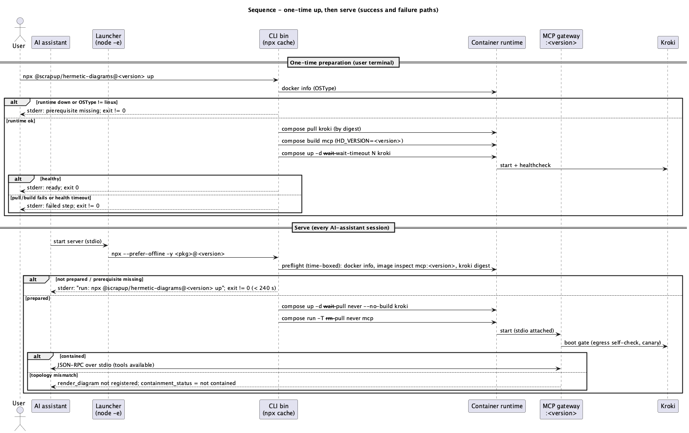

# Technical Plan: Cross-platform entry point and one-time preparation

> SDD Phase 2 — the How. Implements `spec.md` (same folder). Diagrams: `diagrams/*.puml`
> (source of truth) with rendered `.png` alongside.

## 1. Architecture Overview

- **Main Decision:** every install channel launches the service through **`npx` with an exact,
  pinned version of `@scrapup/hermetic-diagrams`**, wrapped by an inline **`node -e` launcher** in
  `.mcp.json` so one config works on Windows, macOS and Linux (RN-01, RN-02, RN-08). The bundled
  `dist/` in the plugin cache is no longer executed.
- **Approach:** split the CLI's work into two paths:
  - **`up`** (user-run, once per version) does all heavy work: pull Kroki by digest, build the MCP
    image for this version, start Kroki and wait for `healthy` (RN-03, RN-04).
  - **`serve`** (assistant-run, every session) runs a **time-boxed preflight** and fails fast with
    the exact `up` command when anything is missing; otherwise it attaches stdio to the prepared
    image with `--pull never` (and `--no-build` on `up`; `compose run` has no such flag, so image presence is enforced by the preflight) (RN-05).
  - The MCP image tag carries the package version, `hermetic-diagrams-mcp:<version>` (RN-06).
- **Client-side build:** the published package ships a **slim `Dockerfile`** that copies the
  prebuilt `dist/` and installs production deps from a shipped lockfile (RN-07).
- **Repository affected:** `scrapup/hermetic-diagrams` only.

## 2. Solution Diagrams

### 2.1 C4 Level 2 (Containers)

Source: [`diagrams/c4-container.puml`](diagrams/c4-container.puml) —


### 2.2 C4 Level 3 (Components — CLI bin)

Source: [`diagrams/c4-component.puml`](diagrams/c4-component.puml) —


### 2.3 Sequence (up + serve, success and failure)

Source: [`diagrams/sequence-up-serve.puml`](diagrams/sequence-up-serve.puml) —


## 3. Artifacts and Configuration (no data persistence)

The feature has no database. Its "data model" is the set of versioned configuration artifacts.

### 3.1 `.mcp.json` (plugin + project scope)

```json
{
  "mcpServers": {
    "hermetic-diagrams": {
      "command": "node",
      "args": [
        "-e",
        "const w=process.platform==='win32';const c=require('node:child_process').spawn(w?'npx.cmd':'npx',['--prefer-offline','-y','@scrapup/hermetic-diagrams@'+process.argv[1]],{stdio:'inherit',shell:w});c.on('exit',x=>process.exit(x??1));c.on('error',()=>process.exit(127))",
        "0.3.1"
      ]
    }
  }
}
```

| Element | Decision | Reason |
|---|---|---|
| `command: node` | The only executable guaranteed on every OS once `npx` exists | `npx` is `npx.cmd` on Windows and cannot be spawned without a shell |
| `shell: true` only on `win32` | Required by Node ≥ 18.20/20.12 to spawn `.cmd` files | Arguments are constants plus the version string; no user input reaches the shell |
| Version as `args[2]` | `node -e` exposes it as `process.argv[1]` (verified) | Lets release-please bump it with a plain `jsonpath` (RN-09) |
| `--prefer-offline` | Reuse the npx cache without a registry round-trip on each session | Keeps `serve` independent of network after first fetch |
| No `${CLAUDE_PLUGIN_ROOT}` | Removed | Fixes the broken duplicate when the repo is opened in an assistant |

### 3.2 `compose.yaml`

- `mcp.image: hermetic-diagrams-mcp:${HD_VERSION:?HD_VERSION is required}` — replaces `:dev`.
  The CLI always exports `HD_VERSION` from its own `package.json`.
- Everything else unchanged (network `internal: true`, no ports, no volumes, no socket).

### 3.3 Packaged files (`package.json` → `files`)

| Add | Why |
|---|---|
| `Dockerfile` | Client-side build of the MCP image |
| `.dockerignore` | Reworked: must **not** exclude `dist` any more (today it does) |
| `npm-shrinkwrap.json` | npm never publishes `package-lock.json`; the shrinkwrap is the npm-supported lockfile that ships, so `npm ci` in the image stays reproducible |

The shrinkwrap is generated in the release job from `package-lock.json` (`npm shrinkwrap`)
before `npm publish`; the repository keeps `package-lock.json` as its lockfile.

### 3.4 Slim `Dockerfile`

Single build stage + runtime, base image still pinned by digest:

1. `COPY package.json npm-shrinkwrap.json ./` → `npm ci --omit=dev --ignore-scripts`.
2. `COPY dist ./dist`.
3. Runtime: `USER node`, `CMD ["node", "dist/index.js"]`.

No TypeScript compilation on the client. Developers building from a checkout run `npm run build`
first; `up` from a checkout fails with a clear message if `dist/` is missing.

### 3.5 `release-please-config.json`

Add an `extra-files` entry: `type: json`, `path: .mcp.json`,
`jsonpath: $.mcpServers['hermetic-diagrams'].args[2]`.

A unit test asserts `.mcp.json` `args[2]` equals `package.json` `version` and that no `latest`
or range is used (spec edge case "floating or mismatched version").

## 4. Interface Contracts (CLI)

No REST or messaging. The contract is the CLI surface and its exit codes.

| Command | Behaviour | Exit |
|---|---|---|
| `up` | preflight (runtime, OSType) → `compose pull kroki` → `compose build mcp` → `compose up -d --wait --wait-timeout <N> kroki` | `0` ready; `≠0` failing step named on stderr |
| `serve` (default) | preflight (runtime, OSType, Compose ≥ 2.24, `image inspect` of the images from `compose config --images` **plus** `hermetic-diagrams-mcp:<v>`, which compose omits because the gateway sits behind a profile) → `compose up -d --wait --pull never --no-build kroki` → `compose run -T --rm --pull never mcp` | child's exit code; `≠0` with fix-it message when not prepared |
| `down` / `pull` / `help` | Unchanged | — |

**Fix-it message (stderr, single line):**
`hermetic-diagrams: version <v> is not prepared — run: npx @scrapup/hermetic-diagrams@<v> up`

**Time boxes (RN spec §5: failure within 240 s):** each preflight probe has its own timeout; the
sum of preflight timeouts is ≤ 60 s, well under the 240 s ceiling and under typical client
startup waits. `<N>` for `up --wait-timeout` is a named constant; the exact value is set in the
task after measuring Kroki's cold start.

## 5. Resilience, Security and Error Handling

### 5.1 Failure Matrix

| Component | Failure | Strategy | User impact |
|---|---|---|---|
| Container runtime | Not installed / not running | Preflight `docker info` time-boxed; stop | Actionable stderr, exit ≠ 0 |
| Container runtime | Windows containers mode | Preflight `OSType != linux`; stop | Message names Linux containers mode |
| npm registry | Unreachable on first `npx` | npx fails before the CLI runs | npx error on stderr; user retries with network |
| Image registries | Unreachable during `up` | Step fails; no partial state is treated as ready (image tag only exists after a successful build) | `up` exit ≠ 0 |
| Kroki | Not healthy within `--wait-timeout` | `up` fails | `up` exit ≠ 0 |
| MCP image | Missing for this version (upgrade without `up`) | `serve` preflight; no build, no pull | Fix-it message within the time box |
| Docker Compose | Too old for `--wait` / `--pull never` / `--no-build` | Preflight checks `docker compose version` against a minimum | Message names the minimum version |
| Launcher | `npx` not found | `error` event → exit 127 | Assistant shows the server failed |

### 5.2 Security

- **Containment unchanged (RN-10):** network `internal: true`, no published ports, images pinned
  by digest, `KROKI_SAFE_MODE=SECURE`, MCP has no outbound client. Boot gate and golden
  exfiltration test untouched.
- **Network use is setup-only:** npx (package fetch) and `up` (image pull, `npm ci` during build)
  run outside the `hermetic` network and never see diagram source.
- **Supply chain:** exact version pin (never `latest`), npm provenance kept, `npm ci --ignore-scripts`
  against a shipped shrinkwrap, base image by digest.
- **Launcher shell on Windows:** only constant arguments and the version string (from a versioned
  file) reach `cmd.exe`; no user-controlled input.

### 5.3 Observability

Local CLI, no telemetry by design. Diagnostics are stderr lines prefixed `hermetic-diagrams:`.

| Type | Pattern | When | Purpose |
|---|---|---|---|
| stderr (info) | `hermetic-diagrams: <step>…` | Each `up` step | Progress in the user's terminal |
| stderr (error) | `hermetic-diagrams: <cause> — run: …` | Any preflight / step failure | Actionable diagnosis in the assistant's MCP log |
| stdout | — | Never during setup | Reserved for MCP JSON-RPC (RN-11) |

## 6. Documentation

- `README.md` (EN, source), `README.pt.md`, `README.ja.md`, with the navigation line used by
  `scrapup/README.md`: `🌐 **English** | [日本語](./README.ja.md) | [Português](./README.pt.md)`.
- Install section rewritten around: install channel → `npx @scrapup/hermetic-diagrams@<v> up` →
  open the assistant. Manual registration uses the same `.mcp.json` launcher.
- `CLAUDE.md` "Status: early — no application code" is stale; update the status and the
  build/test commands in the same change.

## 7. Testing Strategy

| Level | Scope |
|---|---|
| Unit | `parseCommand`; version binding / fix-it message; preflight decisions (runtime down, OSType, image missing/present, time-box expiry) with `spawn` mocked; `.mcp.json` ↔ `package.json` version guard; launcher `node -e` string builds the right spec per platform |
| Integration (Linux CI) | `npm pack` → install tarball in a clean dir → `up` → `serve` → `containment_status` contained; `serve` before `up` fails fast with the fix-it line |
| Golden | Existing exfiltration test unchanged, must pass |
| Manual | Windows (Docker Desktop, Linux containers) and macOS: plugin install → `up` → `/mcp` connected; evidence recorded in the PR |

## 8. Trade-offs and Rejected Options

| Option | Why rejected |
|---|---|
| Keep executing the plugin-cache `dist/` | Different entry point per channel; depends on `${CLAUDE_PLUGIN_ROOT}`; user decision: npx is the entry point |
| Plain `"command": "npx"` | Does not start on native Windows without a `cmd /c` wrapper |
| Publish the MCP image to a registry | Removes the client build but adds registry, signing and promotion infrastructure |
| Full multi-stage build (tsc) on the client | Slower, larger package, recompiles an already-built `dist/` |
| Mount host `dist/` as a volume | Breaks "no volumes" on the MCP service |
| Build/pull inside `serve` | Root cause of the observed timeout (spec §1) |

**Out of scope (noted consequence):** the orphan `dist` branch is no longer needed to run the
plugin (only its manifests and `.mcp.json` are). Simplifying or retiring it is a separate change.
