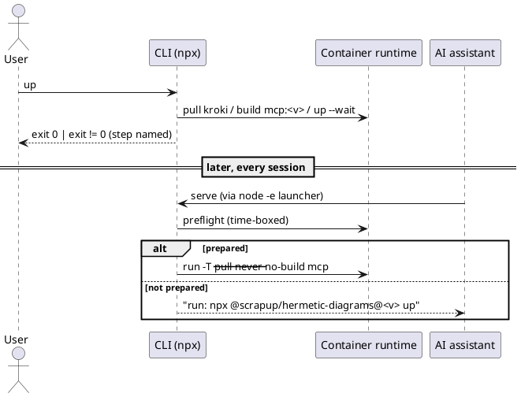

# Execution Backlog: Cross-platform entry point and one-time preparation (hermetic-diagrams)

> SDD Phase 3. Prerequisites: approved `spec.md` and `plan.md` (same folder).
> Personal project — no Sami stack. Scope: CLI lifecycle, packaging, plugin manifest, docs.

## Reference Epic

**Epic:** E-00 — hermetic-diagrams (personal initiative; no PM). Macro context: `spec.md` +
`plan.md` in this same folder.

---

## Traceability

| Requirement (spec.md) | Decision (plan.md) | User Story | Tasks |
|---|---|---|---|
| RN-06 | MCP image tag `hermetic-diagrams-mcp:${HD_VERSION}` bound to `package.json` version (§3.2) | US-79 | TF-79-01 |
| RN-07 | Slim `Dockerfile`, `.dockerignore` keeps `dist`, `npm-shrinkwrap.json` shipped (§3.3, §3.4) | US-79 | TF-79-02 |
| RN-03, RN-04, RN-11 | `up` = preflight → pull → build → `up --wait` (§4) | US-79 | TF-79-03 |
| RN-05, 240 s SLA | `serve` time-boxed preflight + fix-it line; `--pull never --no-build` (§4, §5.1) | US-79 | TF-79-04 |
| RN-01, RN-02, RN-08, RN-09 | `node -e` launcher in `.mcp.json`, version in `args[2]`, release-please bump, version guard (§3.1, §3.5) | US-79 | TF-79-05 |
| RN-10, spec §5 criteria | Packed-artifact integration test, golden unchanged, manual Windows/macOS (§7) | US-79 | TF-79-06 |
| RN-12 | `README.md` / `README.pt.md` / `README.ja.md` with nav line (§6) | US-80 | TF-80-01 |
| plan §6 (stale status) | `CLAUDE.md` status + commands | US-80 | TF-80-02 |

Reference diagrams (plan.md §2): [C4 N2](diagrams/c4-container.puml),
[C4 N3](diagrams/c4-component.puml), [Sequence up + serve](diagrams/sequence-up-serve.puml).

---

## Test and Regression Strategy (applies to every task)

No task is done without **new tests for its behaviour** and **proof that nothing that passed
before now fails**.

### Baseline (before TF-79-01)

Run on `main`, record results (pass counts + coverage %) in saga project `test-config:hermetic-diagrams`
via `baseline-assessment`, and in the PR description:

```bash
npm ci && npm run build && npm run typecheck && npm run lint
npm run test:coverage          # unit + coverage thresholds (80% lines/functions/branches/statements)
npm run test:golden            # exfiltration proof (Docker)
npm run test:integration       # compose stack, all notations (Docker)
```

### Regression gates

| Gate | When | Commands | Pass condition |
|---|---|---|---|
| **G1 — fast** | End of **every** TF | `npm run typecheck && npm run lint && npm run build && npm run test:coverage` | 0 failures; no previously passing test removed or skipped; coverage ≥ 80% on all four metrics and not below baseline for touched files |
| **G2 — containment** | End of every TF touching `compose.yaml`, `Dockerfile`, `.dockerignore`, `src/cli/**` or `test/helpers/**` (TF-79-01..04, 06) | G1 + `npm run test:golden && npm run test:integration` | Golden exfiltration and all integration cases green |
| **G3 — release shape** | TF-79-02, TF-79-05, TF-79-06 | G2 + packed-artifact integration (TF-79-06) + `claude plugin validate .` | Built from the tarball alone; plugin manifest valid |
| **G4 — cross-OS** | TF-79-06 (US-79 gate) | Manual checklist on Windows and macOS | Evidence recorded in the PR |

Rules:
- Never delete, `skip` or loosen an existing assertion to make a gate pass; a behaviour change in an
  existing test requires an explicit note in the PR tying it to an RN in `spec.md`.
- Logic lives in testable modules under `src/cli/` (covered); `src/cli/bin.ts` stays a thin
  dispatcher (it is excluded from coverage in `vitest.config.ts`).
- Unit tests mock `node:child_process` `spawn`; they never need Docker.
- The CI matrix (`validate` on ubuntu/macos/windows) must stay green — unit tests must not assume
  POSIX paths or `/` separators.

### Test catalogue

| ID | Level | Case | Task |
|---|---|---|---|
| T-01 | unit | `readPackageVersion` returns the semver from `package.json` | TF-79-01 |
| T-02 | unit | missing / non-semver version → typed error, no Docker spawn | TF-79-01 |
| T-03 | unit | `imageRef` / `upCommand` format for a given version | TF-79-01 |
| T-04 | unit | every compose spawn receives `HD_VERSION` in `env` | TF-79-01 |
| T-05 | integration | `docker compose config` without `HD_VERSION` fails; with it, image is `hermetic-diagrams-mcp:<v>` | TF-79-01 |
| T-06 | integration | `test/helpers/compose.ts` passes `HD_VERSION`; existing golden + integration suites green | TF-79-01 |
| T-07 | integration | MCP image builds from an extracted `npm pack` tarball (no `src/`, no checkout) | TF-79-02 |
| T-08 | integration | built image runs as `node`, exposes no ports, has no `src/` | TF-79-02 |
| T-09 | unit | `npm pack --dry-run --json` file list includes `Dockerfile`, `.dockerignore`, `npm-shrinkwrap.json`, `dist/cli/bin.js`; excludes `src/`, tests | TF-79-02 |
| T-10 | unit | `docker-runner`: exit code passthrough, spawn `error` → 127, timeout kills child → timeout code, capture mode returns stdout | TF-79-03 |
| T-11 | unit | preflight: Docker unreachable → reason + hint | TF-79-03 |
| T-12 | unit | preflight: `OSType` = `windows` → Linux-containers hint | TF-79-03 |
| T-13 | unit | preflight: Compose below minimum / unparsable version → hint | TF-79-03 |
| T-14 | unit | preflight: probe exceeds its timeout → reported as that probe; total budget ≤ 60 s | TF-79-03 |
| T-15 | unit | `up` step order pull → build → up `--wait`; stops at first failing step and names it | TF-79-03 |
| T-16 | unit | `up` from a checkout without `dist/` → clear message, no build spawn | TF-79-03 |
| T-17 | unit | nothing written to stdout in `up` / preflight | TF-79-03 |
| T-18 | integration | `up` on a clean Docker state → exit 0, Kroki `healthy`, image `:<v>` present; second `up` → exit 0 | TF-79-03 |
| T-19 | unit | `serve` not prepared (MCP image missing) → fix-it line with exact version, exit ≠ 0, no `up`/`run` spawn | TF-79-04 |
| T-20 | unit | `serve` Kroki image missing → same fix-it path | TF-79-04 |
| T-21 | unit | `serve` prepared → `up -d --wait --pull never --no-build kroki` then `run -T --rm --pull never --no-build mcp` | TF-79-04 |
| T-22 | unit | no `serve` spawn ever contains `build`, `pull` (as subcommand) or omits `--pull never` | TF-79-04 |
| T-23 | unit | `serve` writes nothing to stdout before `run -T` | TF-79-04 |
| T-24 | unit | `parseCommand` unchanged: `[]`→serve, `up`, `down`, `pull`, `help`, `-h`, unknown→help (existing `args.spec.ts` kept) | TF-79-03/04 |
| T-25 | unit | `.mcp.json` `args[2]` === `package.json` version; exact semver (no `latest`, `^`, `~`, `*`) | TF-79-05 |
| T-26 | unit | launcher string, evaluated with stubbed `child_process`: `win32` → `npx.cmd` + `shell: true`; others → `npx`, no shell; args `--prefer-offline -y @scrapup/hermetic-diagrams@<v>` | TF-79-05 |
| T-27 | unit | launcher: child `exit` code propagated; spawn `error` → 127 | TF-79-05 |
| T-28 | unit | `release-please-config.json` has the `.mcp.json` `extra-files` entry with the expected `jsonpath` | TF-79-05 |
| T-29 | unit | `.mcp.json` contains no `${CLAUDE_PLUGIN_ROOT}` and no `"command": "npx"` | TF-79-05 |
| T-30 | integration | packed tarball installed in a temp dir → `up` → `serve` over stdio → `containment_status` contained, `list_formats` answers | TF-79-06 |
| T-31 | integration | packed tarball, MCP image removed → `serve` exits ≠ 0 with fix-it line in < 60 s | TF-79-06 |
| T-32 | golden | existing exfiltration test, unchanged | all G2 |
| T-33 | manual | Windows + macOS: plugin install → `up` → `/mcp` connected → `containment_status` contained; not-prepared path shows fix-it line | TF-79-06 |
| T-34 | doc check | README EN/PT/JA: identical code blocks and heading count; nav line present | TF-80-01 |
| T-35 | doc check | every command in `CLAUDE.md` runs | TF-80-02 |

---

## User Stories Overview

| # | User Story | Value Delivered | Depends on |
|---|---|---|---|
| US-79 | Prepared once, fast start on every OS | `npx …@<v> up` once, then the assistant connects on Windows, macOS and Linux; never a silent timeout | — |
| US-80 | Trilingual public documentation | README in EN/PT/JA describing the new flow; internal guide up to date | US-79 (content) |

---

## US-79: Prepared once, fast start on every OS

**Epic:** E-00 · **System:** scrapup/hermetic-diagrams · **Estimate:** 8 SP · **Priority:** P0

### Value Narrative
> **As a** user on Windows, macOS or Linux, **I want** to prepare the service once with `up` and
> have every AI-assistant session start it quickly from the same pinned entry point, **so that**
> the first use works and any missing prerequisite is reported instead of timing out.

### Business Context
The Windows test failed with `Connection closed`: `serve` pulled Kroki, built the MCP image and
waited for health inside the client's startup window. The plugin also ran a cache copy through
`${CLAUDE_PLUGIN_ROOT}`, which breaks when the repo's `.mcp.json` is loaded as project config. The
npm package cannot build the MCP image at all (no `Dockerfile`).

### Acceptance Criteria
- [ ] Fresh machine (Linux CI; Windows and macOS manually): install → `npx @scrapup/hermetic-diagrams@<v> up` → assistant connects → `containment_status` contained.
- [ ] Assistant connects before `up`: one stderr line with the exact `up` command, exit ≠ 0, well under 240 s.
- [ ] `.mcp.json` carries the exact package version, bumped by release-please; a test blocks drift.
- [ ] Opening this repo in Claude Code no longer shows a failing `hermetic-diagrams` server.
- [ ] Golden exfiltration test passes unchanged.

### Applicable Business Rules
| # | Rule | Type |
|---|---|---|
| RN-01, RN-02, RN-08 | Single pinned entry point, same config on every OS | Mandatory / Restrictive |
| RN-03, RN-04 | `up` does all heavy work and ends healthy or failed | Mandatory |
| RN-05, RN-06 | `serve` never pulls/builds; prepared state is version-bound | Restrictive |
| RN-07, RN-09 | Package is self-sufficient; release bumps the pin | Mandatory |
| RN-10, RN-11 | Containment unchanged; diagnostics never on stdout | Restrictive |

### Diagram (single container path; see plan.md §2.3 for the full sequence)



### Task Sequencing
| # | Task | Scope | Depends on |
|---|---|---|---|
| TF-79-01 | Version binding and versioned MCP image tag | CLI + compose | — |
| TF-79-02 | Slim client-side Dockerfile and self-sufficient package | Packaging + release job | TF-79-01 |
| TF-79-03 | Preflight and improved `up` | CLI | TF-79-01 |
| TF-79-04 | `serve` fail-fast | CLI | TF-79-03 |
| TF-79-05 | Cross-platform `.mcp.json` launcher and release pin | Plugin manifest + release | TF-79-01 |
| TF-79-06 | End-to-end validation (packed artifact + Windows/macOS) | Tests + manual | TF-79-02..05 |

### Tasks

#### TF-79-01: [hermetic-diagrams] Version binding and versioned MCP image tag
**User Story:** US-79 · **Priority:** P0

##### 1. Description & Objective
> **As the** CLI, **I want** to know my own package version and pass it to Compose as `HD_VERSION`,
> **so that** the MCP image is tagged per version and a version never runs another one's image (RN-06).

##### 2. Technical Specification
**2.1 Interception points:**
- `src/cli/version.ts` (new) — `readPackageVersion()` from `<pkg>/package.json` (resolved from
  `import.meta.url`, same as `COMPOSE_FILE`); `imageRef(version)` → `hermetic-diagrams-mcp:<version>`;
  `upCommand(version)` → `npx @scrapup/hermetic-diagrams@<version> up`.
- `src/cli/bin.ts` — `runDocker` passes `env: { ...process.env, HD_VERSION }` to every `docker compose` spawn.
- `compose.yaml` — `mcp.image: hermetic-diagrams-mcp:${HD_VERSION:?HD_VERSION is required}` (replaces `:dev`).
- `src/cli/version.spec.ts` (new).
- `test/helpers/compose.ts` — pass `HD_VERSION` (from `package.json`) in `env` to every `docker compose` call; otherwise the existing golden and integration suites break on `${HD_VERSION:?}` (regression risk).

**2.4 Zero Trust:** a missing/invalid `version` in `package.json` (not semver) → fail with exit ≠ 0
before any Docker call. Compose's `:?` makes a bare `docker compose` without the CLI fail loudly
instead of tagging `:` or `:latest`.

##### 4. Execution Guidance
**4.1 Read first:** `src/cli/bin.ts`, `src/cli/args.ts`, `compose.yaml`, `vitest.config.ts`.
**4.3 Validation:** `npm run typecheck && npm run lint && npm test`; `HD_VERSION=0.0.0 docker compose config | grep image:` shows `hermetic-diagrams-mcp:0.0.0`.
**4.4 Constraints:** do not read the version from git or env — only from the shipped `package.json`.
**4.5 Skills:** `test-driven-agentic-development`.
**4.6 Exit criteria:** unit tests for the three helpers and the invalid-version path pass; no `:dev` left in `compose.yaml`.

##### 5. Definition of Done
- [ ] Tests T-01..T-06 implemented and green; regression gates G1 + G2 green (see Test and Regression Strategy).
- [ ] `version.ts` + tests (valid semver, missing field, non-semver).
- [ ] Every compose spawn receives `HD_VERSION`.
- [ ] `compose.yaml` uses `${HD_VERSION:?…}`; `docker compose config` without it fails.

---

#### TF-79-02: [hermetic-diagrams] Slim client-side Dockerfile and self-sufficient package
**User Story:** US-79 · **Priority:** P0

##### 1. Description & Objective
> **As a** user who installed from npm or through npx, **I want** the package to contain everything
> needed to build the MCP image, **so that** `up` works without a source checkout (RN-07).

##### 2. Technical Specification
**2.1 Interception points:**
- `Dockerfile` — single deps stage + runtime (plan §3.4): `COPY package.json npm-shrinkwrap.json ./`
  → `npm ci --omit=dev --ignore-scripts`; `COPY dist ./dist`; `USER node`; `CMD ["node","dist/index.js"]`.
  Base image stays pinned by digest (`ARG NODE_IMAGE=…@sha256:…`).
- `.dockerignore` — remove `dist`; keep excluding `node_modules`, `src`, tests, docs, `.git`.
- `package.json` → `files`: add `Dockerfile`, `.dockerignore`, `npm-shrinkwrap.json`.
- `.github/workflows/release-please.yml` — before `npm publish`, run `npm shrinkwrap` (converts
  `package-lock.json` → `npm-shrinkwrap.json` in the job workspace only).
- `.gitignore` — ignore `npm-shrinkwrap.json` (repo keeps `package-lock.json`).
- Local dev: a checkout without `npm-shrinkwrap.json` must still build — the Dockerfile copies
  `npm-shrinkwrap.jso[n]` and `package-lock.jso[n]` (glob, at least one present) so `npm ci` finds either.

**2.4 Zero Trust:** `npm ci` (never `npm install`) so the build fails on lockfile drift; `--ignore-scripts` kept.
`up` from a checkout without `dist/` → build fails; TF-79-03 turns that into a clear message.

##### 4. Execution Guidance
**4.1 Read first:** `Dockerfile`, `.dockerignore`, `package.json`, `release-please.yml` (publish job).
**4.3 Validation:**
```bash
npm run build && npm shrinkwrap && npm pack
mkdir -p /tmp/hd-pack && tar -xzf scrapup-hermetic-diagrams-*.tgz -C /tmp/hd-pack
HD_VERSION=$(node -p "require('./package.json').version") docker compose -f /tmp/hd-pack/package/compose.yaml build mcp
git checkout package-lock.json && rm -f npm-shrinkwrap.json   # restore repo lockfile
```
**4.4 Constraints:** do not add `src/` or `tsconfig*.json` to `files`; no TypeScript compile in the image.
**4.6 Exit criteria:** the image builds from the extracted tarball alone; `npm pack --dry-run` lists `Dockerfile`, `.dockerignore`, `npm-shrinkwrap.json`, `dist/`.

##### 5. Definition of Done
- [ ] Tests T-07..T-09 implemented and green; regression gates G1 + G2 + G3 green (see Test and Regression Strategy).
- [ ] Image builds from the packed artifact in a clean directory.
- [ ] Image still runs as `node` (non-root), no ports, base pinned by digest.
- [ ] Release job generates the shrinkwrap before publishing.
- [ ] Build from a repo checkout (after `npm run build`) still works.

---

#### TF-79-03: [hermetic-diagrams] Preflight and improved `up`
**User Story:** US-79 · **Priority:** P0

##### 1. Description & Objective
> **As a** user, **I want** `up` to download, build, start and wait for health in one command,
> **so that** a single run leaves the version ready (RN-03, RN-04).

##### 2. Technical Specification
**2.1 Interception points:**
- `src/cli/docker-runner.ts` (new) — extracts `runDocker` from `bin.ts`; adds an optional timeout
  (kills the child, resolves a distinct code) and `capture` mode for probes.
- `src/cli/preflight.ts` (new) — probes, each time-boxed (constants, total ≤ 60 s):
  1. `docker info --format {{.OSType}}` → reachable and `linux`;
  2. `docker compose version --short` → ≥ minimum supporting `up --wait`, `--pull never`, `--no-build` (value fixed in this task, documented in the constant);
  3. (serve only, TF-79-04) image presence.
  Returns a typed result `{ ok: true } | { ok: false, reason, hint }`.
- `src/cli/bin.ts` — `up` = preflight → `compose pull kroki` → `compose build mcp` → `compose up -d --wait --wait-timeout <UP_WAIT_S> kroki`; each step prefixed on stderr (`hermetic-diagrams: pulling…`); first failing step stops with its name. Missing `dist/` detected before build (checkout case) with a clear message.
- `src/cli/*.spec.ts` for preflight and `up` orchestration with `spawn` mocked.

**2.4 Zero Trust / resilience:**

| Failure | Behaviour |
|---|---|
| Docker not running / not installed | `hermetic-diagrams: Docker is not reachable — start Docker Desktop/Engine`; exit ≠ 0 |
| `OSType` ≠ `linux` | message names "Linux containers" mode; exit ≠ 0 |
| Compose too old | message names the minimum; exit ≠ 0 |
| pull/build/health fails | failing step named; exit = child code |
| Probe hangs | killed at its timeout; reported as the failing probe |

`UP_WAIT_S`: measure Kroki cold start on this machine, set to ≥ 2× the measurement, record the number in the constant's comment.

##### 4. Execution Guidance
**4.1 Read first:** `src/cli/bin.ts`, `compose.yaml` (healthcheck), `src/containment/boot-gate.ts` (message style).
**4.3 Validation:** `npm test`; manual: `docker compose down -v && docker rmi hermetic-diagrams-mcp:<v>` then `node dist/cli/bin.js up` ends with exit 0 and Kroki `healthy`; with Docker stopped, `up` fails in < 60 s with the message above.
**4.4 Constraints:** no stdout writes; no new CLI command; no retries that hide failures.
**4.5 Skills:** `test-driven-agentic-development`, `systematic-debugging` if a probe misbehaves.
**4.6 Exit criteria:** all rows in the table above covered by unit tests; manual run recorded.

**4.7 Iterative decomposition:** mode `mimic-loop`, max 20 iterations, saga `exec:hermetic-diagrams:TF-79-03`.

| # | RT | Done when | Depends on |
|---|---|---|---|
| RT-01 | Extract `docker-runner.ts` with timeout/capture | unit tests pass, `bin.ts` behaviour unchanged | — |
| RT-02 | `preflight.ts` (runtime, OSType, compose version) | unit tests for each failure row | RT-01 |
| RT-03 | `up` orchestration + step messages | unit test of the step order and early stop | RT-02 |
| RT-04 | Measure and set `UP_WAIT_S`; manual run | recorded in PR | RT-03 |

##### 5. Definition of Done
- [ ] Tests T-10..T-18, T-24 implemented and green; regression gates G1 + G2 green (see Test and Regression Strategy).
- [ ] `up` leaves the MCP image `:<v>` built and Kroki `healthy`, exit 0.
- [ ] Every failure row yields its message and exit ≠ 0; nothing on stdout.
- [ ] Re-running `up` on a prepared version succeeds without rebuilding unnecessarily (Compose cache).

---

#### TF-79-04: [hermetic-diagrams] `serve` fail-fast
**User Story:** US-79 · **Priority:** P0

##### 1. Description & Objective
> **As an** AI assistant starting the server, **I want** `serve` to attach only to a prepared
> version and otherwise fail at once with the fix-it command, **so that** the user never sees a
> silent timeout (RN-05, 240 s ceiling).

##### 2. Technical Specification
**2.1 Interception points:**
- `src/cli/preflight.ts` — add image probes: `docker image inspect hermetic-diagrams-mcp:<v>` and
  the Kroki image by the digest in `compose.yaml` / `images.lock`.
- `src/cli/bin.ts` — `serve` = preflight (runtime, OSType, compose version, images) → on failure
  print `hermetic-diagrams: version <v> is not prepared — run: npx @scrapup/hermetic-diagrams@<v> up`
  (or the specific prerequisite message) and exit ≠ 0 → on success
  `compose up -d --wait --pull never --no-build kroki` → `compose run -T --rm --pull never --no-build mcp`.
- `src/cli/bin.spec.ts` / `preflight.spec.ts` — prepared vs not-prepared paths.

**2.4 Zero Trust:** `serve` must contain no code path that pulls or builds; `--pull never --no-build`
on both commands make Compose refuse instead of silently doing it. Preflight total ≤ 60 s.

##### 4. Execution Guidance
**4.1 Read first:** TF-79-03 output, `src/cli/bin.ts` `serve()`.
**4.3 Validation:** `npm test`; manual: remove the image → start via launcher → stderr fix-it line, exit ≠ 0 in seconds; prepared → `/mcp` connects.
**4.4 Constraints:** stdout untouched before `run -T` (it is the JSON-RPC channel).
**4.6 Exit criteria:** unit tests prove no pull/build argument ever reaches `serve`'s spawns.

##### 5. Definition of Done
- [ ] Tests T-19..T-24 implemented and green; regression gates G1 + G2 green (see Test and Regression Strategy).
- [ ] Not prepared → fix-it line with the exact version, exit ≠ 0, measured < 60 s.
- [ ] Prepared → tools available; `containment_status` contained.
- [ ] Unit test asserts `--pull never --no-build` on every `serve` compose call.

---

#### TF-79-05: [hermetic-diagrams] Cross-platform `.mcp.json` launcher and release pin
**User Story:** US-79 · **Priority:** P0

##### 1. Description & Objective
> **As a** user of any install channel on any OS, **I want** the plugin config to start the pinned
> npm package through one launcher, **so that** the same file works everywhere and never runs the
> cache copy (RN-01, RN-02, RN-08, RN-09).

##### 2. Technical Specification
**2.1 Interception points:**
- `.mcp.json` — exact content from plan §3.1 (`node -e` launcher, version in `args[2]`).
- `release-please-config.json` — `extra-files`: `{ "type": "json", "path": ".mcp.json", "jsonpath": "$.mcpServers['hermetic-diagrams'].args[2]" }`.
- `src/plugin/mcp-config.spec.ts` (unit project — `vitest.config.ts` only picks up `src/**/*.spec.ts`) — asserts `args[2] === package.json.version`, exact
  semver (no `latest`, `^`, `~`), and that `args[1]` spawns `npx.cmd` with `shell` only on `win32`
  (evaluate the launcher string with a stubbed `child_process`).
- `.claude-plugin/plugin.json` — `mcpServers` still points to `./.mcp.json` (no change expected; verify).

**2.4 Zero Trust:** the only dynamic value reaching `cmd.exe` on Windows is the version from a
versioned file; the guard test blocks any non-semver value.

##### 4. Execution Guidance
**4.1 Read first:** `.mcp.json`, `.claude-plugin/plugin.json`, `release-please-config.json`.
**4.3 Validation:** `npm test`; `claude plugin validate .`; open this repo in Claude Code → `/mcp` shows no failing project-scope `hermetic-diagrams` (after TF-79-01..04 published, or with a locally published version).
**4.4 Constraints:** no `${CLAUDE_PLUGIN_ROOT}`; no `"command": "npx"`.
**4.6 Exit criteria:** guard test green; `claude plugin validate .` passes.

##### 5. Definition of Done
- [ ] Tests T-25..T-29 implemented and green; regression gates G1 + G3 green (see Test and Regression Strategy).
- [ ] `.mcp.json` uses the launcher with the current version.
- [ ] release-please bumps `args[2]` (verified with `release-please` dry run or by config review against the existing `extra-files` entries).
- [ ] Guard test fails on a mismatched or floating version.

---

#### TF-79-06: [hermetic-diagrams] End-to-end validation (packed artifact + Windows/macOS)
**User Story:** US-79 · **Priority:** P1

##### 1. Description & Objective
> **As the** validator, **I want** proof that the published shape works from a clean location and
> on each OS, **so that** the Windows failure is closed with evidence, not assumption.

##### 2. Technical Specification
**2.1 Interception points:**
- `test/integration/…` — new case: `npm pack` → install the tarball into a temp dir → run its bin
  `up` → run `serve` over stdio → call `containment_status` → expect contained; second case: remove
  the MCP image → `serve` exits ≠ 0 with the fix-it line.
- `.github/workflows/ci.yml` — `containment` job runs the new case (Linux only, as today).
- Golden exfiltration test: unchanged, must pass.

**Manual (recorded in the PR):** Windows (Docker Desktop, Linux containers) and macOS — install the
plugin from a pre-release or a locally published version → `npx @scrapup/hermetic-diagrams@<v> up` →
`/mcp` connected → `containment_status` contained; plus the "not prepared" path.

##### 4. Execution Guidance
**4.3 Validation:** `npm run test:integration && npm run test:golden`.
**4.4 Constraints:** do not add Docker to the Windows/macOS CI runners (unsupported there, plan §7).
**4.6 Exit criteria:** CI `containment` green; manual evidence for Windows and macOS attached.

##### 5. Definition of Done
- [ ] Tests T-30..T-33 implemented and green; regression gates G1 + G2 + G3 + G4 green (see Test and Regression Strategy).
- [ ] Packed-artifact integration test green in CI.
- [ ] Golden exfiltration test green.
- [ ] Windows and macOS manual evidence recorded.

---

## US-80: Trilingual public documentation

**Epic:** E-00 · **System:** scrapup/hermetic-diagrams · **Estimate:** 3 SP · **Priority:** P1

### Value Narrative
> **As a** visitor reading in English, Portuguese or Japanese, **I want** the same README in my
> language with the new `up` flow, **so that** I can install and prepare the service correctly.

### Acceptance Criteria
- [ ] `README.md` (EN, source), `README.pt.md`, `README.ja.md` with identical content.
- [ ] Each starts with the nav line used by `scrapup/README.md`.
- [ ] Install section describes: channel → `npx @scrapup/hermetic-diagrams@<v> up` → open the assistant; manual registration shows the launcher JSON.
- [ ] `CLAUDE.md` reflects the real status and commands.

### Applicable Business Rules
| # | Rule | Type |
|---|---|---|
| RN-12 | EN source; PT/JA replicate every EN change in the same commit | Mandatory |

### Task Sequencing
| # | Task | Scope | Depends on |
|---|---|---|---|
| TF-80-01 | README EN/PT/JA | Docs | TF-79-05 (final commands) |
| TF-80-02 | `CLAUDE.md` status and commands | Internal docs | TF-79-06 |

### Tasks

#### TF-80-01: [hermetic-diagrams] README in English, Portuguese and Japanese
**User Story:** US-80 · **Priority:** P1

##### 1. Description & Objective
> **As a** visitor, **I want** the README in three languages, **so that** the project matches the
> scrapup organization's public-surface convention.

##### 2. Technical Specification
**2.1 Interception points:**
- `README.md` — first lines: title, then `🌐 **English** | [日本語](./README.ja.md) | [Português](./README.pt.md)`;
  rewrite **Requirements** (Docker in Linux-containers mode, Node ≥ 24 for npx) and **Install**
  (plugin / Copilot / manual registration with the launcher JSON; then the one-time `up`; `down`).
- `README.pt.md`, `README.ja.md` (new) — full translations; nav line with the current language in
  bold and the others linked (`[English](./README.md)`).
- `package.json` → `files`: keep only `README.md` (npm shows one README); PT/JA live in the repo.

**2.4 Zero Trust:** every command in the three files matches what TF-79-06 validated; code blocks,
JSON and command names are identical across languages (only prose is translated).

##### 4. Execution Guidance
**4.1 Read first:** `README.md`, `../scrapup/README.md`, `../scrapup/README.pt.md`, `../scrapup/README.ja.md` (tone and nav line).
**4.3 Validation:** diff the three files' code blocks (`grep -A…` or a small script) — identical; headings count equal.
**4.4 Constraints:** PT/JA tone and terminology consistent with `scrapup/README.pt.md` / `README.ja.md`; no content only in one language.
**4.6 Exit criteria:** three files, same structure, same code blocks, links resolve.

##### 5. Definition of Done
- [ ] Tests T-34 implemented and green; regression gates G1 green (see Test and Regression Strategy).
- [ ] Three READMEs with nav line and identical structure/code blocks.
- [ ] Install flow reflects `up` + launcher.

---

#### TF-80-02: [hermetic-diagrams] `CLAUDE.md` status and commands
**User Story:** US-80 · **Priority:** P2

##### 1. Description & Objective
> **As a** contributor (human or agent), **I want** `CLAUDE.md` to describe the real state and
> commands, **so that** guidance does not contradict the code.

##### 2. Technical Specification
**2.1 Interception points:** `CLAUDE.md` — replace "Status: early — no application code…" and
"Planned stack (not yet scaffolded)" with the current state; add build/test/run commands
(`npm run build|lint|test|test:golden|test:integration`, single test: `npx vitest run <path>`),
the `up`/`serve` split, the `.mcp.json` launcher and the rule "never `${CLAUDE_PLUGIN_ROOT}` in `.mcp.json`".

##### 4. Execution Guidance
**4.3 Validation:** each command listed runs successfully.
**4.6 Exit criteria:** no statement in `CLAUDE.md` contradicts the repository.

##### 5. Definition of Done
- [ ] Tests T-35 implemented and green; regression gates G1 green (see Test and Regression Strategy).
- [ ] Status and commands current; containment section unchanged.

---

## Execution note

Recommended order: TF-79-01 → (TF-79-02 ∥ TF-79-03 ∥ TF-79-05) → TF-79-04 → TF-79-06 → TF-80-01 →
TF-80-02. TF-79-06 is the gate: US-79 is not done without the Windows evidence. The orphan `dist`
branch simplification stays out of scope (plan §8).
