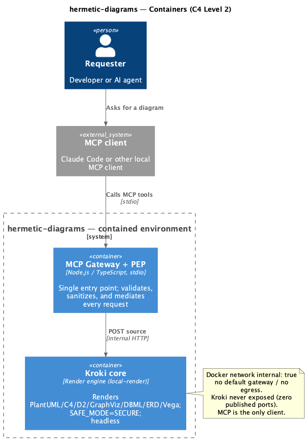
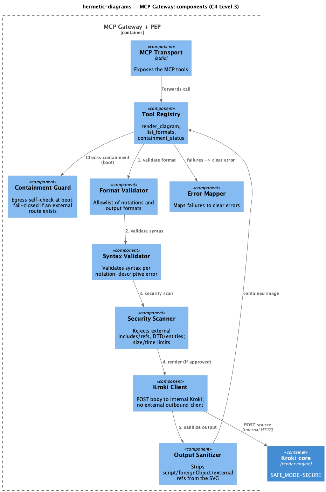
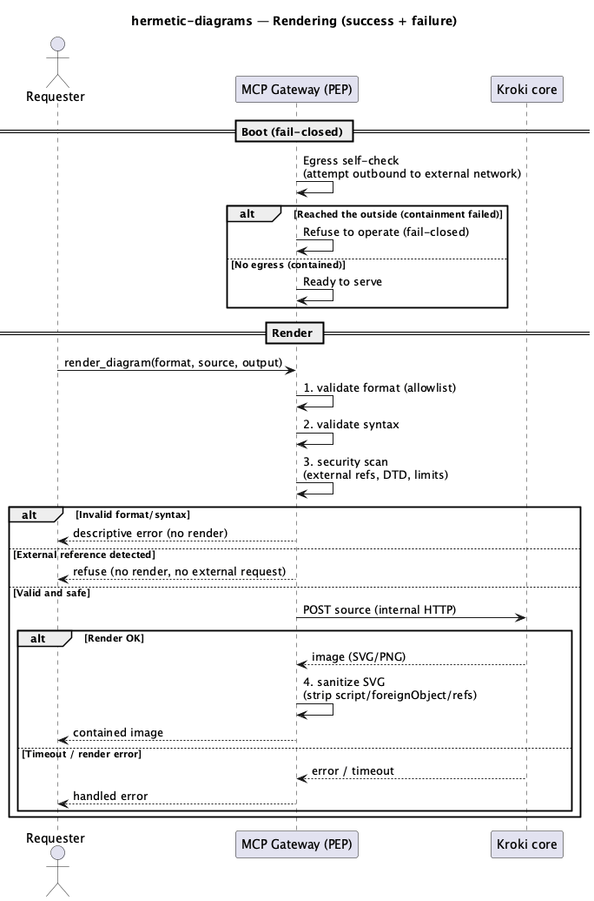

# Technical Plan: hermetic-diagrams (MVP)

> SDD Phase 2 — the real architecture (the How). Prerequisite: approved `spec.md`.
> Stack: Node.js + strict TypeScript, MCP SDK (stdio), Docker + Docker Compose, Kroki core image.
> Personal project — **no** Sami ecosystem integration (no NestJS, sami-broker, sami-logger,
> MongoDB/Redis, RabbitMQ). Standalone MCP server, no messaging and no database.

## 1. Architecture Overview

- **Main Decision:** an **MCP Gateway** (Node/TS, stdio transport) acting as a Policy Enforcement
  Point (PEP) and the **sole client** of a headless **Kroki core**. Both run on a **Docker
  `internal: true` network** (no default gateway, no egress). The lifecycle is declared in **Docker
  Compose**; the `@scrapup/hermetic-diagrams` package ships the bin that brings the compose up and
  wires the MCP client's stdio to the gateway container.
- **Approach:** containment **by construction** (a network with no external route) + a semantic PEP
  at the edge + **fail-closed via an egress self-check** at boot. Synchronous (render on demand), no
  queues, no DB.
- **Affected repository:** `scrapup/hermetic-diagrams`.
- **MVP scope:** local-render notations (the `yuzutech/kroki` core image, no Chromium companions);
  SVG (default) + PNG output; online image pull by digest on first run; stdio only.

**Refinement over the initial analysis (two points):**
1. **Lifecycle via Docker Compose, not `dockerode` inside the MCP.** Since the MCP runs in a
   container, delegating the lifecycle to Compose avoids mounting the Docker socket into the MCP
   container (which would reopen surface and give the MCP access to the daemon). The MCP holds no
   Docker privilege — it only talks to Kroki over the internal network.
2. **Fail-closed via an active egress self-check, not Docker API inspection.** Without the socket,
   the MCP proves containment **empirically**: at boot it attempts an outbound connection to an
   external target; if it **succeeds**, it refuses to operate. Direct proof of no egress, stronger
   than reading configuration.

### 1.1 Packaging and execution

| Artifact | Role |
|---|---|
| `@scrapup/hermetic-diagrams` package | bin/CLI (Node) the MCP client invokes; orchestrates the compose and proxies stdio to the gateway container |
| `compose.yaml` | Declares the `internal: true` network and the `mcp` + `kroki` services (pinned by digest) |
| `mcp` image | The MCP Gateway (Node/TS) — built in this repo |
| `kroki` image (core) | The render engine, pinned by `sha256`, `KROKI_SAFE_MODE=SECURE` |

The command registered in the MCP client resolves to something like `docker compose run -T mcp`
(stdio attached). Compose brings `kroki` up as a dependency and creates the internal network; the
gateway reaches Kroki over internal DNS (`kroki:8000`). No port is published.

**Lifecycle.** `kroki` is a long-running service (`docker compose up -d`) with a healthcheck: it
comes up once and **persists across sessions**, to avoid paying the boot (~seconds) on every
render. The gateway container is ephemeral per session (`run -T`). The bin exposes a cleanup
subcommand (`down`). The gateway only serves after Kroki's healthcheck passes.

### 1.2 Setup vs runtime boundary

The image `pull` uses the Docker daemon's network — that is **setup**, happens once, and before the
`internal` network exists. Integrity of what is pulled comes from **digest pinning**
(`image@sha256:…`, verified by Docker). **Containment holds at runtime**: once up, no container in
the stack has an external route. The network is required only at setup, never at render time.

## 2. Solution Diagrams

### 2.1 C4 Level 2 — Containers



Source: [`diagrams/c4-container.puml`](diagrams/c4-container.puml)

### 2.2 C4 Level 3 — MCP Gateway components



Source: [`diagrams/c4-component.puml`](diagrams/c4-component.puml)

### 2.3 Sequence — success + failure



Source: [`diagrams/sequence-render.puml`](diagrams/sequence-render.puml)

## 3. State, Configuration, and Persistence

**No database and no persistent state between requests.** The MCP is stateless; each render is
independent. Configuration is declarative and versioned:

| Config | Content | Use |
|---|---|---|
| `images.lock` (digests) | `sha256` of the homologated `kroki`/`mcp` images | Supply-chain pin; promotion only after re-proving containment |
| Format allowlist | allowed input notations + output formats | Format Validator |
| Limits | max source size, render timeout | Security Scanner / Kroki Client |

A render cache (memoization by source hash) is **out of MVP scope** — note as a future improvement;
if adopted, it is in-memory and local, never shared externally.

## 4. Integration Contracts (MCP tools)

Transport: **MCP over stdio**. Three tools.

### 4.1 `render_diagram`

**Request:**
```json
{
  "format": "string — notation; required; must be in the allowlist (plantuml | c4 | d2 | graphviz | dbml | erd | vega | vega-lite)",
  "source": "string — diagram text; required; non-empty; up to the size limit",
  "output": "string — svg | png; optional; default svg"
}
```

**Response (success):**
```json
{
  "format": "svg | png",
  "mimeType": "image/svg+xml | image/png",
  "encoding": "utf8 | base64",
  "data": "string — sanitized SVG (utf8) or image (base64)"
}
```

**Response (error):**
```json
{
  "error": {
    "code": "INVALID_FORMAT | INVALID_SYNTAX | EXTERNAL_REFERENCE | EMPTY_CONTENT | TOO_LARGE | RENDER_TIMEOUT | RENDER_ERROR | NOT_CONTAINED",
    "message": "string — actionable description",
    "detail": "string — optional; e.g., syntax error location"
  }
}
```

> **`NOT_CONTAINED` realization.** The gateway is fail-closed by *not registering* `render_diagram`
> when boot containment fails, rather than registering it and returning a `NOT_CONTAINED` error per
> call — a stronger guarantee (the capability does not exist without containment). `NOT_CONTAINED` is
> therefore observable via the always-registered `containment_status` tool (`contained: false`), not
> as a `render_diagram` error in practice; it is retained in the error enum for completeness.

### 4.2 `list_formats`

**Response:**
```json
{
  "input": ["plantuml", "c4", "d2", "graphviz", "dbml", "erd", "vega", "vega-lite"],
  "output": ["svg", "png"]
}
```

### 4.3 `containment_status`

**Response:**
```json
{
  "contained": true,
  "checks": {
    "egressSelfCheck": "pass | fail",
    "krokiSafeMode": "SECURE",
    "publishedPorts": "none"
  }
}
```

### 4.4 Internal MCP → Kroki contract

`POST http://kroki:8000/{diagramType}/{outputFormat}` with body = source (`text/plain`).
**Always POST with a body — never GET with the source in the URL** (avoids source in logs/caches).
Internal network only; no TLS required (internal network, no exposure).

## 5. Resilience, Security, and Error Handling

### 5.1 Failure Matrix

| Component | Failure | Strategy | Impact on Requester |
|---|---|---|---|
| Egress self-check | Detects an external route at boot | **Fail-closed**: gateway refuses to start | Tool unavailable until containment is fixed (correct by design) |
| Input | Invalid format/syntax, empty | Reject before rendering | Descriptive error (`INVALID_*`, `EMPTY_CONTENT`) |
| Input | External reference / XML entity | Reject in the security scan | Refusal (`EXTERNAL_REFERENCE`); no external request emitted |
| Input | Exceeds size | Reject | `TOO_LARGE` |
| Kroki | Timeout / render error | Abort with timeout; map error | `RENDER_TIMEOUT` / `RENDER_ERROR` |
| Kroki | Container not ready (first run) | Compose brings the dependency up; await readiness; on failure, setup error | First use slower |
| Canary render (boot) | Remote include to the sink escapes | **Fail-closed**: gateway refuses to serve (`NOT_CONTAINED`) | Unavailable until renderer containment is fixed |
| Resources | Diagram blows up CPU/memory (local DoS) | Container resource limits + timeout + `PLANTUML_LIMIT_SIZE`; abort | `RENDER_TIMEOUT` / `RENDER_ERROR` |
| Concurrency | Too many simultaneous requests | Concurrency limit (queue/semaphore) in the MCP | Queued or rejected with a clear error |
| Output | SVG with script/foreignObject/refs | Sanitize before delivery | Contained image |
| Images | Pull fails on first run (no network) | Clear setup error (network needed once) | Setup pending |

### 5.2 Security (the three barriers)

- **Barrier 1 — PEP (semantic):** Format Validator (allowlist) → Syntax Validator (per notation) →
  Security Scanner (rejects external references **per format** — see table — disables XML
  DTD/entities, blocks `%getenv`, size/time limits). Fail-closed on any source not safely
  interpretable.
- **Barrier 2 — `internal: true` network (primary guarantee):** no external route; applies to Kroki
  too. Proven by egress self-check + canary render at boot (see 5.4).
- **Barrier 3 — `KROKI_SAFE_MODE=SECURE`:** the engine refuses file/URL includes.
- **Output:** the Output Sanitizer processes the SVG with a **real XML parser + an allowlist** of
  elements and attributes (never regex), removing `script`, `foreignObject`, and remote
  `href`/`url()`; fail-closed if it cannot sanitize with confidence.
- **MCP surface:** no external outbound HTTP client (talks only to internal `kroki`); images pinned
  by `sha256`; no Docker socket in the MCP container; Kroki with a **minimal env** (no secrets, to
  neutralize `%getenv`).

**External-reference vectors by notation** (the Security Scanner has a dedicated rule for each):

| Notation | Vectors to block |
|---|---|
| PlantUML / C4 | remote `!include`/`!includeurl`/`!includesub`, sprites ``, `!theme … from url`, `%getenv` |
| D2 | remote `@import`/`imports`, `icon: https://` |
| GraphViz | `image=`, `imagepath`, URLs in attributes |
| Vega / Vega-Lite | **`data.url`** (fetching data by URL), background/images by URL |
| DBML / ERD | references to external files/URLs |

### 5.3 Observability (local, no external telemetry)

Consistent with containment: **no telemetry leaves**. Structured **local** logs (stderr), consumed
by the client/operator.

| Type | Event | When | Rule |
|---|---|---|---|
| Log (info) | `boot.containment` | Boot | Egress self-check result and SAFE_MODE |
| Log (info) | `render.ok` | Render completed | Format, output, duration — **never** the source |
| Log (warn) | `request.rejected` | Rejection | Reason code — **never** the source nor the full external reference |
| Log (error) | `render.error` | Kroki failure | Code/error — no source |

Local metrics (in-memory counters, exposed via `containment_status`/logs) are optional; no external
exporter. **RN-07:** the source never appears in a log, URL, or artifact that could leave.

### 5.4 Containment verified at runtime (boot gates)

Containment is **proven at every startup**, not assumed:

1. **Egress self-check (MCP):** the gateway attempts a TCP connect to a fixed public IP with a short
   timeout; if it **connects**, it returns `NOT_CONTAINED` and refuses to serve. Proves no external
   route on the shared network.
2. **Canary render (renderer):** the gateway asks Kroki — **bypassing the PEP on purpose** — for a
   diagram with a remote reference to a controlled sink; the render must fail/ignore without the
   request leaving. Proves the *engine's* containment, not just the MCP's.
3. **Kroki healthcheck:** only serves after Kroki reports readiness.

Any failed gate → fail-closed (`NOT_CONTAINED`). The canary is the same mechanism as the CI golden
test (see 7.1), run here at boot in every real environment.

### 5.5 Limits and local-DoS protection

A small source can blow up at render (preprocessor loops, giant graph, "billion laughs"):

| Limit | Where |
|---|---|
| Max source size | PEP (before sending) |
| Render timeout | Kroki Client (aborts) |
| `PLANTUML_LIMIT_SIZE` and equivalents | Kroki config |
| Container resources (mem/CPU/pids) | `deploy.resources` / `--memory` / `--pids-limit` in compose |
| Max concurrency | Queue/semaphore in the MCP; overflow queues or rejects |
| Max output size | Kroki Client (rejects before base64 over stdio) |

## 6. Rationale and Trade-offs

| Decision | Rejected Alternative | Rationale |
|---|---|---|
| Kroki core in Docker `internal: true` | Wrap the PlantUML binary (`SANDBOX`) | Multi-format coverage + containment by construction; the binary only covers PlantUML |
| Lifecycle via Docker Compose | MCP manages via `dockerode` | MCP in a container with no Docker socket = smaller surface; Compose declares the internal network + Kroki |
| Fail-closed via active egress self-check | Docker API inspection | Empirical proof of no egress; independent of socket/privilege; better aligned with "prove, don't trust" |
| Local-render only (core, no companions) | Kroki full with Chromium | Lean MVP, smaller surface; Mermaid/BPMN/Excalidraw in a later cycle |
| Online pull by digest | Offline bundle (`save`/`load`) | Simplicity in the MVP; air-gapped support in a later cycle |
| stdio only | stdio + HTTP | Smaller surface; HTTP would require ensuring the endpoint cannot become an egress route |
| SVG default + PNG; sanitized SVG | PNG only | SVG is vector/native/lightweight; sanitization removes the residual vector at the consumer |
| Persistent Kroki (`up -d`) | Ephemeral per render | Avoids ~seconds of boot per render; healthcheck ensures readiness |
| Canary render at boot | Golden test in CI only | Proves renderer containment in every real environment, not just CI |

## 7. Testing, CI, and Homologation Strategy

### 7.1 Test layers

- **Unit (no Docker):** validators (format/syntax), Security Scanner (one case per vector **and** per
  notation — see table in 5.2), Output Sanitizer, Error Mapper, Egress self-check (socket mocked),
  bin argument handling. Fast, hermetic, no containers. A **coverage threshold** is enforced.
- **Integration (local docker-compose):** bring the stack up with `docker compose up -d` on the
  `internal: true` network and exercise it end-to-end — render each notation to SVG and PNG through
  the MCP against the **real Kroki**, assert the sanitized output, and assert containment
  (`docker compose ps` shows no published port; `docker network inspect` shows `internal`; egress
  self-check + canary pass). Always torn down (`docker compose down -v`) even on failure.
- **Golden exfiltration test (gate):** for each notation, a source with an external reference to a
  controlled sink; passes only if the sink is **never** reached. Same mechanism as the boot canary
  (5.4); runs against the compose stack.
- **Tool contracts:** validation of the `render_diagram`/`list_formats`/`containment_status` schemas.

### 7.2 CI pipeline (validation gates)

Every PR runs, in order, and any red stage blocks merge:

| Stage | Gate |
|---|---|
| Install | deterministic install (lockfile) |
| Typecheck | `tsc --noEmit`, strict, zero errors |
| Lint | ESLint, zero errors (incl. `no-explicit-any`) |
| Build | `npm run build` succeeds |
| Unit + coverage | unit suite green; coverage ≥ threshold |
| Integration (compose) | compose stack e2e green (7.1) |
| Golden exfiltration | zero sink hits across all notations |

Runs on the **Windows/macOS/Linux** matrix (Docker Desktop/WSL2 on Windows), covering the bin (stdio
proxy) and compose behavior. The integration + golden stages require the Docker daemon on the runner.

### 7.3 Image homologation (supply chain)

Bumping an image digest requires: (1) update `images.lock` with the new `sha256`; (2) re-run the
golden exfiltration test + the compose integration suite of all notations; (3) only then promote. No
image enters via a mutable tag. A dedicated CI job fails if `images.lock` changes without the
containment suites passing.
