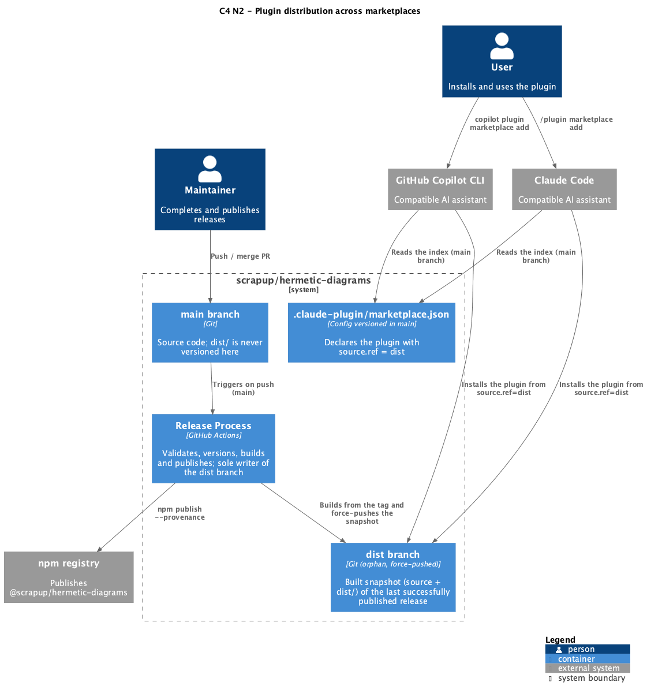
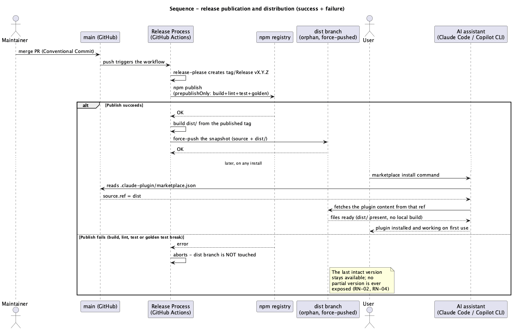

# Technical Plan: Reliable plugin distribution across AI-assistant marketplaces

> SDD Phase 2 — the real architecture (the How). Prerequisite: approved `spec.md`.
> Personal project — no integration with the Sami ecosystem (no NestJS/sami-broker/sami-logger/
> database/RabbitMQ). The scope here is release/distribution infrastructure, not business domain.

## 1. Architecture Overview

- **Main Decision:** the compiled `dist/` stays out of `main` (`.gitignore` unchanged). The
  release process (`release-please.yml`), **after** publishing successfully to npm, builds from
  the just-created tag and force-commits (`git add -f dist`) onto a **dedicated orphan branch
  `dist`**, overwriting it on every release (`git push --force`). `.claude-plugin/marketplace.json`
  — the same file that already serves Claude Code — declares the plugin's `source` pointing at
  that branch (`ref: "dist"`), instead of at the repository's default branch.
- **Approach:** no change to the install command on any channel (RN-05). The fix is entirely on
  the side of whoever prepares the distribution — resolving what content each AI assistant fetches
  happens inside `marketplace.json`, not in the user's command.
- **Affected Repository:** `scrapup/hermetic-diagrams` (no other repository in the ecosystem is
  touched).
- **Channels covered:** Claude Code (`/plugin marketplace add`) and GitHub Copilot CLI (`copilot
  plugin marketplace add`) — both read `.claude-plugin/marketplace.json` natively and support the
  same structured `source` format with a `ref` field.

## 2. Solution Diagrams

### 2.1 C4 Level 2 — Containers



Source: [`diagrams/c4-container.puml`](diagrams/c4-container.puml)

### 2.2 Sequence — release publication and distribution (success + failure)



Source: [`diagrams/sequence-release-distribution.puml`](diagrams/sequence-release-distribution.puml)

> No C4 Level 3 (Components) for this feature — there is no application container with internal
> components being changed; the change is entirely pipeline/declarative configuration. The C4 N2
> already covers the relevant granularity.

## 3. Configuration and Versioning

> No database, no domain schema in this feature. This section replaces "Data Modeling" from the
> standard template with the declarative configuration that actually changes.

### 3.1 `dist` branch (new)

| Property | Value |
|---|---|
| Name | `dist` |
| Nature | Orphan (no shared history with `main`); **never** receives a merge or a PR |
| Writer | Exclusively the release job, via the workflow's `GITHUB_TOKEN`/`contents: write` |
| Content | Full repository snapshot at the just-published tag **plus** `dist/` (`git add -f dist`, bypassing `.gitignore` only for this specific commit) |
| Update | `git push --force` on every successful release — replaces the previous snapshot wholesale, without accumulating history |
| Protection | Branch-protection rule: push allowed only from the release workflow's identity/token; no human commits to it directly |

### 3.2 `.claude-plugin/marketplace.json` (change)

The plugin's entry now declares `source` as a structured object, instead of an implicit string
resolved from the default branch:

```json
{
  "name": "hermetic-diagrams",
  "source": { "source": "github", "repo": "scrapup/hermetic-diagrams", "ref": "dist" },
  "description": "…",
  "version": "…"
}
```

`marketplace.json` itself is still read from `main` (the install command's fixed default, RN-05)
— only the `source` of the plugin listed inside it changes target.

### 3.3 `.claude-plugin/plugin.json` (change)

Add the explicit `mcpServers` field, pointing at the already-existing `.mcp.json` — needed because
Copilot CLI (unlike Claude Code) does not discover the MCP server automatically by filename
convention:

```json
{
  "mcpServers": ".mcp.json"
}
```

### 3.4 `.mcp.json` (no content change — risk to validate)

Keeps referencing `${CLAUDE_PLUGIN_ROOT}/dist/cli/bin.js`. None of the official sources consulted
confirm that Copilot CLI expands that variable (Copilot CLI's official documentation only confirms
`${PLUGIN_ROOT}`/`${PLUGIN_DATA}`; a secondary source mentions `CLAUDE_PLUGIN_ROOT` as an accepted
alias, but that was not confirmed in primary documentation). Treated as an **explicit technical
risk** (section 5.1) — the mitigation is empirical validation (actually installing on both
channels) before declaring the feature done, not an assumption.

## 4. Integration Contracts

No API contract (REST/messaging) in this feature. The relevant "contract" is the schema of the
configuration files each AI assistant consumes — already documented in sections 3.2 and 3.3. Both
formats (structured `source` with `ref`, explicit `mcpServers`) follow exactly the schema
published by each platform's official documentation (see Rationale, section 6, for the sources
consulted).

## 5. Resilience, Security, and Error Handling

### 5.1 Failure and Risk Matrix

| Component | Failure/Risk | Strategy | Impact |
|---|---|---|---|
| Building `dist/` for the `dist` branch | Fails (compile error) after `npm publish` already succeeded | The force-push-to-`dist` job only runs **after** `npm publish` confirms success; if the build fails here, the `dist` branch is left untouched — the previous version on it stays intact (RN-04) | The npm package for the new version is already published; marketplace installs keep serving the previous version until the next successful release |
| Force-push to `dist` | Permission/network failure mid-push | `git push --force` is atomic on the Git side — either the new snapshot is accepted wholesale, or the branch stays at its previous state; no partial state is possible | None — same guarantee as above |
| CI loop | The push to `dist` could re-trigger workflows | The `dist` branch matches no `on: push: branches: [...]` trigger in any existing workflow (`ci.yml`, `pr-title.yml`, `release-please.yml` only listen on `main` and PRs) | None — no loop risk, confirmed by reading the existing triggers |
| `${CLAUDE_PLUGIN_ROOT}` not expanded by Copilot CLI | The MCP server fails to start on that specific channel, even with `dist/` present | Technical risk not resolved by design — the mitigation is empirical validation (a dedicated smoke-test task on both channels) before declaring the US done; if confirmed, the concrete fix (e.g. switching to `${PLUGIN_ROOT}`, or a path relative to `cwd`) is decided from the actual test result, not anticipated here | Blocks RN-06 (channel parity) until resolved |
| Someone commits directly to the `dist` branch | Drift between the "official" snapshot (from the action) and what is on the branch | Branch protection restricting pushes to `dist` to the release workflow's identity | The next release's force-push overwrites any drift anyway — the mitigation is preventive, not corrective |

### 5.2 Security

- **Job permission scope:** the step that force-pushes to `dist` runs with the same
  `GITHUB_TOKEN`/`contents: write` permission already granted to `release-please.yml` — no new
  secret is introduced.
- **Branch protection on `dist`:** restrict pushes to that branch to the workflow's (bot)
  identity, so that an accidental manual force-push from a human contributor cannot corrupt the
  published snapshot.
- **No new sensitive data:** the force-pushed content is source code already public in `main` plus
  the build — nothing changes regarding information exposure.

### 5.3 Observability

Reuses the pattern already in place in the project — structured logs from GitHub Actions itself
(no external telemetry anywhere in this project, as a matter of repository principle).

| Type | Event | When | Purpose |
|---|---|---|---|
| Log (Actions job) | Build + force-push to `dist` completed | After `npm publish` succeeds | Confirm distribution was updated alongside the npm publish |
| Log (Actions job) | Build for `dist` failed/aborted | Failure at any step before the force-push | Signal that the `dist` branch stays at the previous version — not a silent failure, shows up as a red workflow run |

## 6. Rationale and Trade-offs

| Decision | Rejected Alternative | Rationale |
|---|---|---|
| Orphan `dist` branch, force-pushed by the action | Commit `dist/` directly into `main` on every release | Avoids polluting the source history with binary/build diffs on every release; avoids the drift window where `main` would have a stale `dist/` between one release and the next; avoids needing `[skip ci]` to prevent a workflow loop |
| Orphan `dist` branch | Keep the manual post-install build (status quo) | Does not satisfy RN-01 (installation with no manual step); keeps the breakage that motivated this spec |
| A single `marketplace.json` serving both channels, with per-plugin `source.ref` | Duplicate `marketplace.json` per platform | Confirmed in official sources that both assistants read the same file/folder (`.claude-plugin/`) and accept the same structured `source` format — duplicating it would create two maintenance points for the same information, violating RN-07 |
| Empirical validation of `${CLAUDE_PLUGIN_ROOT}` as a dedicated task, instead of assuming a value | Pick a "presumably safe" variable without testing | Copilot CLI's official documentation only confirms `${PLUGIN_ROOT}`/`${PLUGIN_DATA}`; the only source mentioning `CLAUDE_PLUGIN_ROOT` as an accepted alias is secondary. Assuming without testing would violate the Zero Trust principle already governing this repository (`CLAUDE.md`: "Prove, don't trust") |

**Technical sources consulted for the schema decisions (sections 3.2–3.4):**
- [Creating a plugin marketplace for GitHub Copilot CLI](https://docs.github.com/en/copilot/how-tos/copilot-cli/customize-copilot/plugins-marketplace) — confirms Copilot CLI also reads `marketplace.json` from `.claude-plugin/`.
- [GitHub Copilot CLI plugin reference](https://docs.github.com/en/copilot/reference/copilot-cli-reference/cli-plugin-reference) — `marketplace.json`/`plugin.json` schema, structured `source` field with `ref`/`sha`, `${PLUGIN_ROOT}`/`${PLUGIN_DATA}` variables.
- [Making Claude Code Plugins Work with Copilot CLI](https://cora7.com/blog/copilot-cli-plugin-portability/) — practical field-by-field comparison between the two platforms (secondary source, used for orientation only, not for claims unconfirmed in official docs).

## 7. Testing and Validation Strategy

There is no automated "plugin install" test suite in the repository today — this feature
introduces the first check of that kind.

- **Manual/documented smoke test (per channel):** after a release publishes the `dist` branch,
  actually install via `/plugin marketplace add scrapup/hermetic-diagrams` (Claude Code) **and**
  via `copilot plugin marketplace add scrapup/hermetic-diagrams` (Copilot CLI), in each case
  confirming the MCP starts and responds to `list_formats` with no manual step. This is the test
  that resolves the risk in section 5.1 (`${CLAUDE_PLUGIN_ROOT}`).
- **Verification that the `dist` branch is never exposed in a partial state:** review the release
  job to confirm the force-push only happens after `npm publish` returns success (guarantees
  RN-02/RN-04 by pipeline construction, not by automated test — there is no deterministic way to
  test "publication interrupted" without simulating an actual network failure).
- **Documentation as an acceptance criterion:** `README.md` updated with the install process for
  both channels (Claude Code and Copilot CLI) is part of this feature's Definition of Done — sliced
  as its own task in `tasks.md`.
